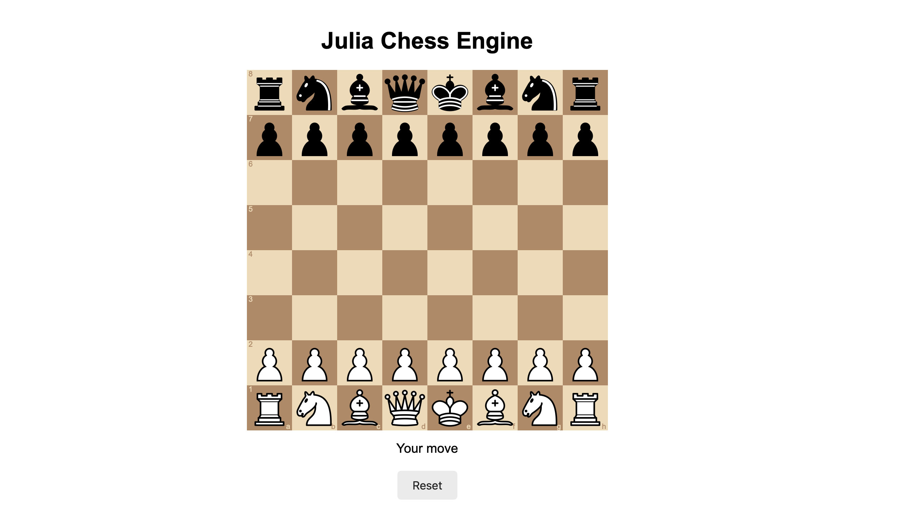

# Chess Engine - Julia Implementation

A high-performance chess engine written in Julia with advanced search algorithms, sophisticated position evaluation, and a web-based GUI interface.

## Features

### Core Engine
- **Advanced Search Algorithm**
  - Negamax with alpha-beta pruning
  - Quiescence search for tactical stability
  - Transposition table for position caching
  - Null move pruning for faster search
  - Late move reductions (LMR)
  - Parallel search with multi-threading support
  
- **Sophisticated Evaluation Function**
  - Material evaluation with piece-square tables (PST)
  - Pawn structure analysis (doubled, isolated, backward, passed pawns)
  - Piece activity evaluation (bishop pairs, knight outposts, rook positioning)
  - King safety assessment (pawn shield, king tropism, zone attacks, pawn storms)
  - Center control and space advantage
  - Endgame-specific king activity
  - Mobility and trapped piece detection

- **Move Ordering**
  - MVV-LVA (Most Valuable Victim - Least Valuable Attacker)
  - Transposition table move priority
  - Center control bonuses
  - Promotion prioritization

- **Opening Book**
  - Pre-compiled opening repertoire
  - Book move selection with randomization

### Web Interface
- Interactive chessboard built with React/TypeScript
- Real-time game state synchronization
- Move validation and legal move highlighting
- Undo/redo functionality
- Position evaluation display
- Search statistics (nodes, NPS, depth)

### Genetic Algorithm Tuning
- Automated weight optimization
- Tournament-based fitness evaluation
- Multi-generational evolution
- Best weights persistence

## Project Structure

```
Chess_engine/
├── frontend/                 # Web-based GUI
│   ├── src/
│   │   ├── App.tsx          # Main React component
│   │   ├── ChessGame.tsx    # Chess board component
│   │   └── main.tsx         # Entry point
│   └── package.json
│
├── resources/
│   └── weights/             # Stored evaluation weights
│       ├── best_weights.txt
│       ├── best_weights6.txt #best ever weights
│
└── src/                     # Julia backend
    ├── EvaluationFunction.jl    # Position evaluation
    ├── Search.jl                # Search algorithms
    ├── Engine.jl                # Main engine logic
    ├── MoveOrdering.jl          # Move ordering heuristics
    ├── TranspositionTable.jl    # TT implementation
    ├── Zobrist.jl               # Zobrist hashing
    ├── OpeningBook.jl           # Opening book handler
    ├── GeneticOptimizer.jl      # Weight tuning
    ├── Server.jl                # Web server
    ├── ConsoleChess.jl          # Console interface
    ├── Playground.jl            # Testing utilities
    └── train.jl                 # Training script
```

## Getting Started

### Prerequisites

**Julia Backend:**
- Julia 1.8 or higher
- Required packages:
  ```julia
  using Pkg
  Pkg.add("Chess")
  Pkg.add("HTTP")
  Pkg.add("JSON3")
  ```

**Frontend (optional):**
- Node.js 16+ and npm
- Modern web browser

### Installation

1. Clone the repository:
```bash
git clone https://github.com/mateuszb0k/Chess_engine.git
cd Chess_engine
```

2. Install Julia dependencies:
```julia
julia --project=. -e 'using Pkg; Pkg.instantiate()'
```

3. (Optional) Install frontend dependencies:
```bash
cd frontend
npm install
```

### Running the Engine

**Console Mode:**
```julia
julia src/ConsoleChess.jl
```

**Web Interface:**
```julia
# Terminal 1 - Start backend server
julia src/Server.jl

# Terminal 2 - Start frontend (in frontend/ directory)
npm run dev
```

Then open your browser at `http://localhost:5173`

**UCI Mode:**
```julia
julia src/UCI.jl
```

## Usage Examples

### Play Against the Engine
```julia
using Chess
include("src/Engine.jl")
include("src/Search.jl")

# Create a new game
board = startboard()

# Get engine move
score, best_move = Search.search_parallel(
    board, 
    6,  # max depth
    use_book=true,
    verbose=true,
    num_threads=4
)

# Make the move
domove!(board, best_move)
```

### Analyze a Position
```julia
include("src/EvaluationFunction.jl")
using .EvaluationFunction

# Load position from FEN
board = fromfen("rnbqkbnr/pppppppp/8/8/8/8/PPPPPPPP/RNBQKBNR w KQkq - 0 1")

# Get evaluation
eval_score = EvaluationFunction.evaluate(board)
println("Position evaluation: $eval_score")
```

### Tune Evaluation Weights
```julia
include("src/GeneticOptimizer.jl")

# Run genetic algorithm
best_weights = train_genetic_algorithm(
    population_size=50,
    generations=100,
    games_per_match=10
)
```

## Evaluation Function Details

The engine uses 45 tunable parameters organized into categories:

### Piece-Square Tables (PST)
- Position-dependent piece values
- Different tables for middlegame and endgame

### Pawn Structure (4 parameters)
- Doubled pawn penalty
- Isolated pawn penalty
- Backward pawn penalty
- Passed pawn bonuses (by rank)

### Piece Evaluation (10 parameters)
- Bishop pair bonus
- Knight outposts (defended/safe/undefended)
- Rook on open/half-open files
- Rook on 7th rank
- Connected rooks
- Knight in closed positions
- Bishop in open positions

### King Safety (8 parameters)
- Pawn shield (close/far/missing)
- King tropism (queen/rook/minor pieces)
- King zone attacks
- Pawn storm

### Positional (7 parameters)
- Center control
- Space advantage
- King activity in endgame
- King centralization in endgame

## Configuration

Default weights are defined in `src/EvaluationFunction.jl` in the `default_weights()` function. You can:

1. Load optimized weights from file:
```julia
weights = EvaluationFunction.load_weights_from_txt("resources/weights/best_weights.txt")
EvaluationFunction.set_weights!(weights)
```

2. Modify weights programmatically:
```julia
weights = EvaluationFunction.default_weights()
weights.bishop_pair_bonus = 60.0  # Increase bishop pair value
EvaluationFunction.set_weights!(weights)
```

## Performance

Typical performance on modern hardware:
- **Search Speed**: 500,000 - 2,000,000 nodes/second (depending on hardware)
- **Transposition Table Hit Rate**: 60-80%
- **Average Branching Factor**: ~35 (reduced to ~10 with move ordering)
- **Tactical Depth**: 6-10 ply in middlegame, 10-15 in endgame
- 
## Output Interpretation

When running with `verbose=true`, the engine outputs detailed search statistics:
```
Parallel search with 10 threads
Depth 1 | Score: 1703.0 | Move: Move(g8g7) | Nodes: 972 | NPS: 591621 | Time: 0.0s
Depth 2 | Score: 1686.0 | Move: Move(g8g7) | Nodes: 2709 | NPS: 518759 | Time: 0.01s
Depth 6 | Score: 1757.0 | Move: Move(g8g2) | Nodes: 214200 | NPS: 1007535 | Time: 0.21s
```

- **Depth**: Search depth in ply (half-moves)
- **Score**: Position evaluation in centipawns (100 = 1 pawn advantage)
- **Move**: Best move found in algebraic notation
- **Nodes**: Total positions evaluated
- **NPS**: Nodes per second (search speed)
- **Time**: Time elapsed in seconds
## Contributing

Contributions are welcome. Areas for improvement:
- Additional evaluation features (king safety patterns, specific endgames)
- Search enhancements (aspiration windows, killer moves, history heuristic)
- Opening book expansion
- UCI protocol improvements
- Performance optimizations

## License

This project is open source and available under the MIT License.

## Acknowledgments

- Built with [Chess.jl](https://github.com/romstad/Chess.jl) by Tord Romstad
- Evaluation concepts from [Chess Programming Wiki](https://www.chessprogramming.org/)
- PST values from chessprogramming.org

## Contact

GitHub: [@mateuszb0k](https://github.com/mateuszb0k)

Project Link: [https://github.com/mateuszb0k/Chess_engine](https://github.com/mateuszb0k/Chess_engine)

---

**Note**: This engine is a work in progress and primarily serves as an educational project for learning chess programming concepts and Julia language features.
